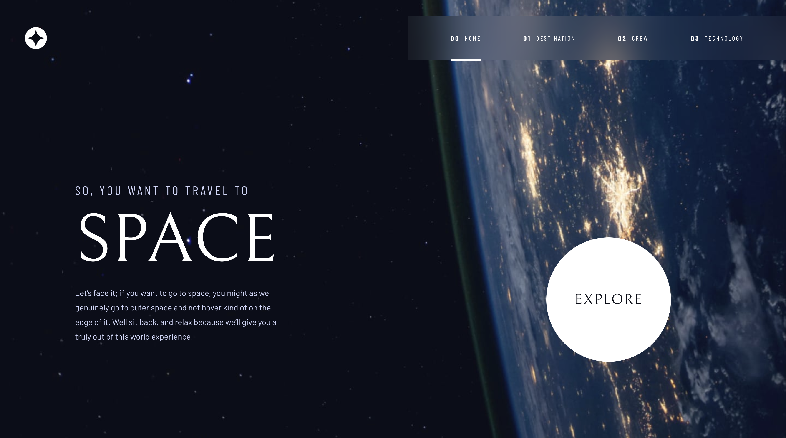
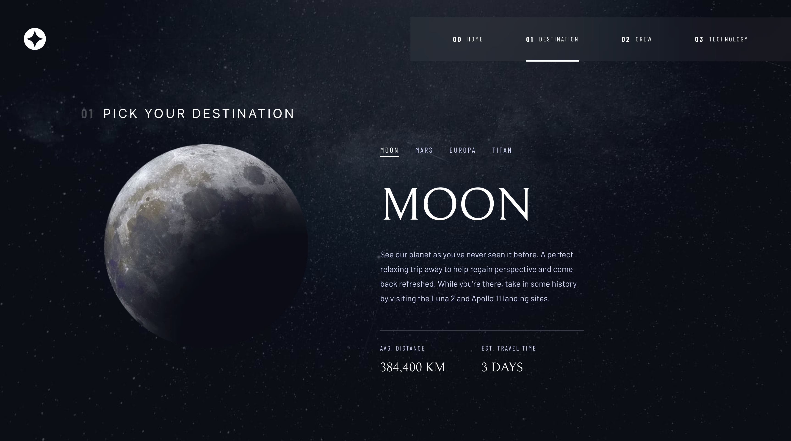
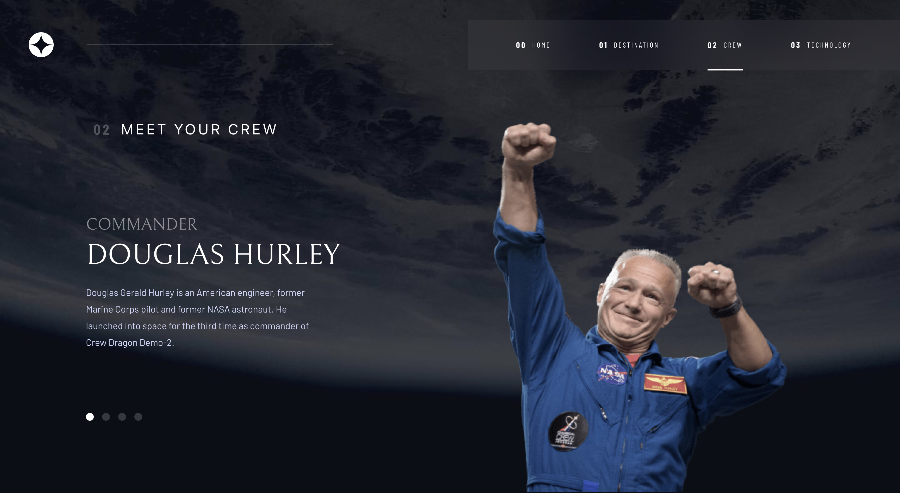
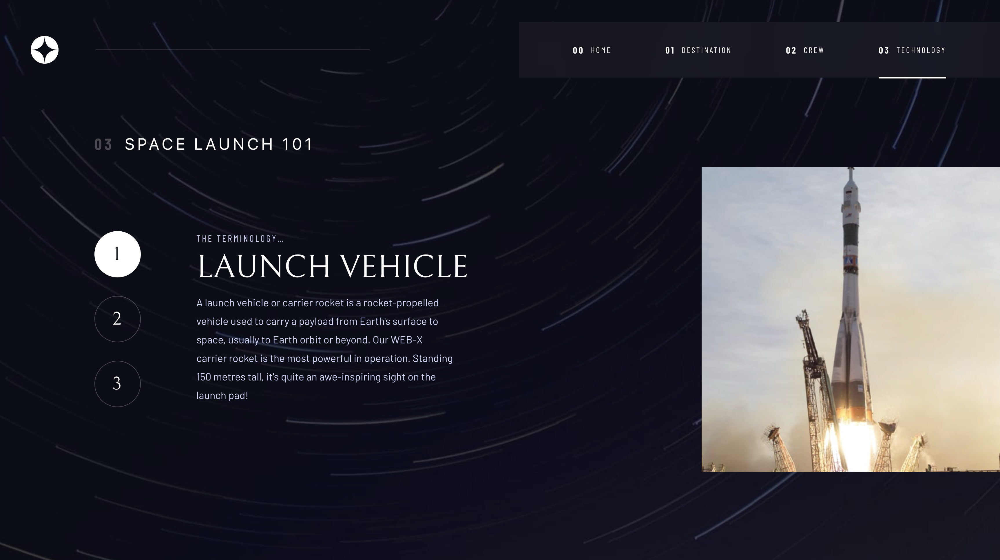

# Frontend Mentor - Space tourism website solution

This is my solution to the [Space tourism website challenge on Frontend Mentor](https://www.frontendmentor.io/challenges/space-tourism-multipage-website-gRWj1URZ3). Frontend Mentor challenges help you improve your coding skills by building realistic projects. 

## Table of contents

- [Overview](#overview)
  - [The challenge](#the-challenge)
  - [Screenshot](#screenshot)
  - [Links](#links)
- [My process](#my-process)
  - [Built with](#built-with)
  - [What I learned](#what-i-learned)
  - [Continued development](#continued-development)
- [Author](#author)

## Overview

### The challenge

Users should be able to:

- View the optimal layout for each of the website's pages depending on their device's screen size
- See hover states for all interactive elements on the page
- View each page and be able to toggle between the tabs to see new information

### Screenshot

#### Home



#### Destination



#### Crew



#### Tech



### Links

- Solution URL: [solution](https://github.com/roodhouse/frontend-mentor-space)
- Live Site URL: [live site](https://space.rugh.us)

## My process

### Built with

- HTML5, CSS
- Mobile-first workflow
- React
- Tailwind
- Framer Motion

### What I learned

The first thing I learned was how to solve the white space issue when using height: 100vh. This has been an issue for me with most projects I have done. 

Here is the issue that height: 100vh creates:


The fix is to use display flex, flex-direction column and height 100vh in the parent div. Then in the last child div use flex grow:1 and height auto.


Here is the code: 

```js

<div className="App flex flex-col h-screen">
      <div id='mainWrapper' className='flex justify-center h-auto grow bg-[url("/src/assets/home/background-home-mobile.jpg")] bg-cover pt-6 pb-12 bg-no-repeat mix-blend-screen'>

```
... well, fast forward a few days... the above was not the solution. It helped but I spent a few hours more customizing a javascript function to elminate the white space on all screen sizes. I think I have the solution now.

```js
useEffect(()=>{
    // change the height
    let mainWrapper = document.getElementById("mainWrapper"); 
    let appOriginalHeight = document.getElementById('mainApp').clientHeight
    let mainWrapperHeight = mainWrapper.clientHeight
    
    if (appOriginalHeight < mainWrapperHeight) {
     let difference = mainWrapperHeight - appOriginalHeight
     document.getElementById('mainApp').style.height = appOriginalHeight + difference + 'px'
    } else if (appOriginalHeight >= mainWrapperHeight) {
     console.log('main O is less')
    }
  },[])
```

Basically the code takes note of the original height of the app div (content) then as clicks are made compares the app div height to the height of the main content div. Next it figures out the difference in height between the 2 divs. If the main content div is larger (in height) than the original height of the app div then the code adds the difference in px to the main app div. I did not figure out how to revert it. As it stands if a click is made on the destination links then the app height is expanded from then on out for any new link clicked. In the best world I would have it revert back to the original height that fits the content appropriately.

### Continued development

See the last statement above.

## Author

- Website - [my site](https://rugh.us)
- Frontend Mentor - [@roodhouse](https://www.frontendmentor.io/profile/roodhouse)
- LinkedIn - [John Rugh](https://www.linkedin.com/in/john-m-rugh/)